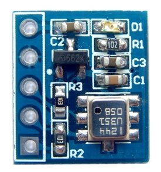
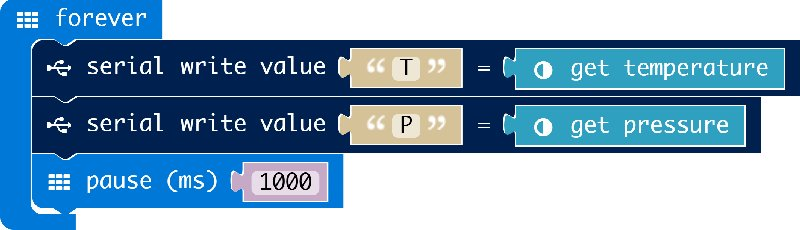

# BMP180

makecode BMP180 Digital Pressure Sensor package for micro:bit  

Author: shaoziyang  
Date:   2018.Jun  

  
  

## usage

open your microbit makecode project, in Add Package, paste  

https://github.com/microbit-makecode-packages/BMP280  

to search box then search.

## I2C Address  

- 0x77  

## API

- function pressure()  
get pressure in hpa  

- function temperature()  
return temperature in Celsius.

## Demo

## License

MIT

Copyright (c) 2018, microbit/micropython Chinese community  

## Supported targets

* for PXT/microbit

[From microbit/micropython Chinese community](http://www.micropython.org.cn)
